# doctor-appointment-system
Doctor Appointment Booking System is a web-based application developed using PHP and MySQL. It allows users to register with email OTP, login securely, book doctor appointments, view and cancel bookings, while admins manage doctors and appointments efficiently.

## Screenshots

### Login
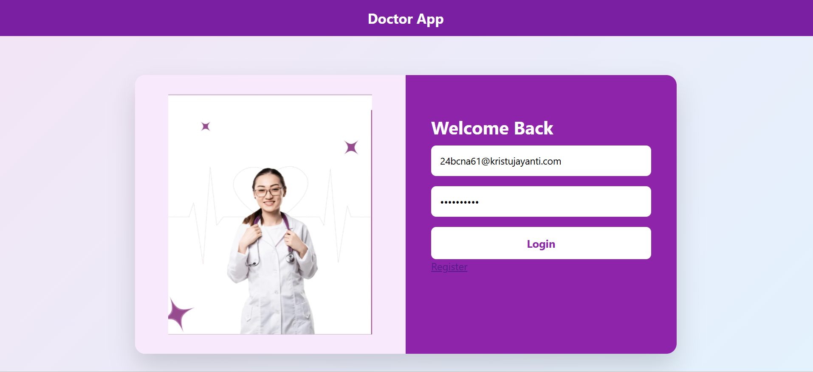

### Register
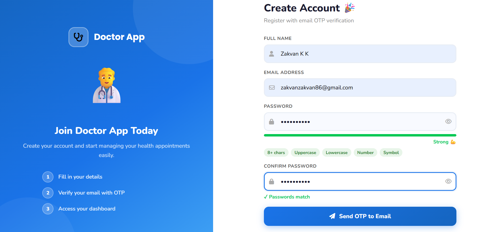

### OTP Verification
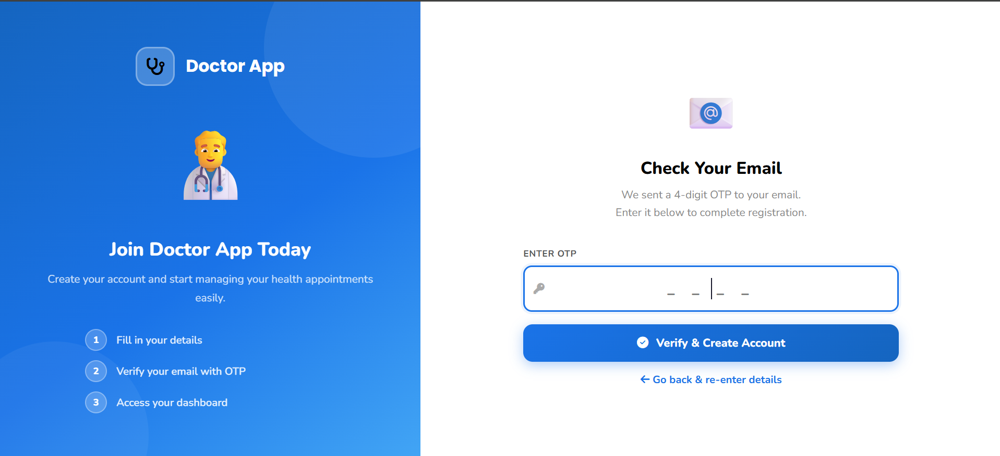

### User Dashboard
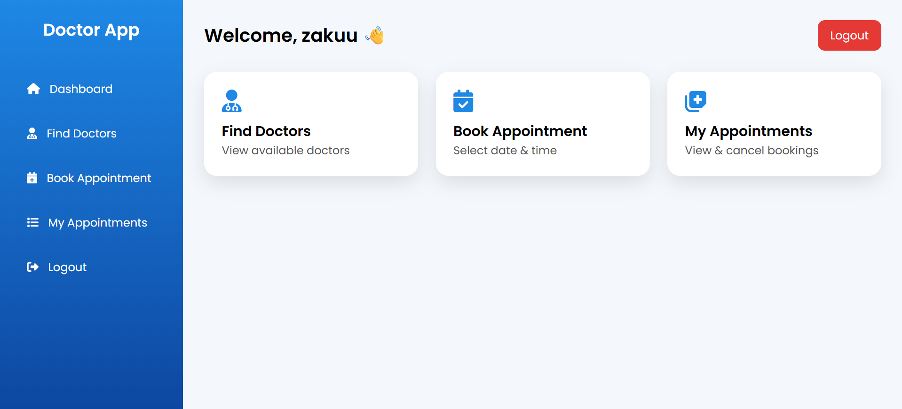

### Book Appointment
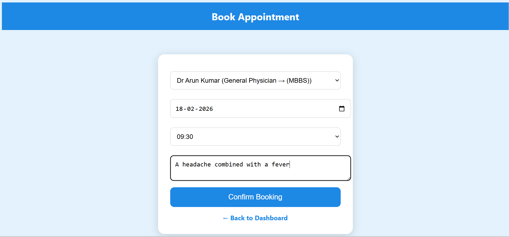

### My Appointments
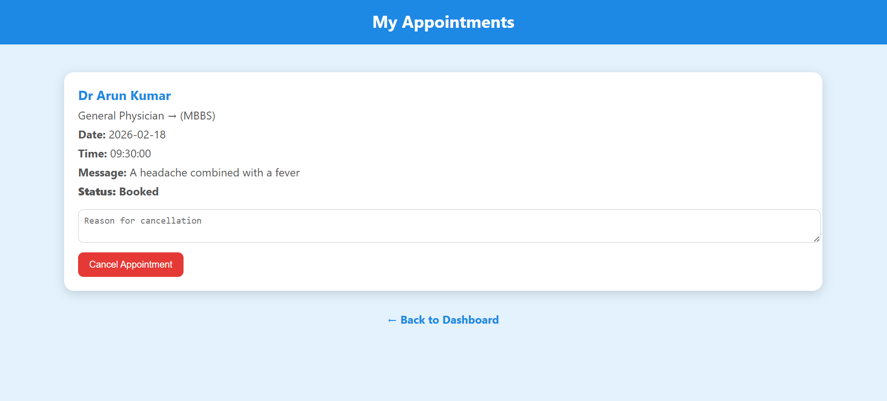

### View Doctors

---

## Admin Module

### Admin Dashboard
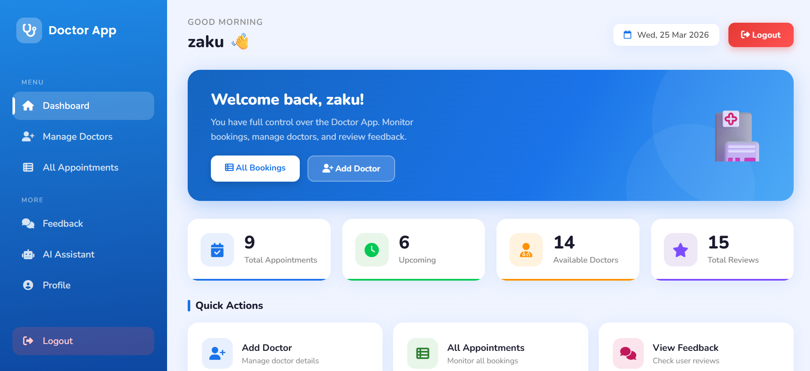

### Add Doctor
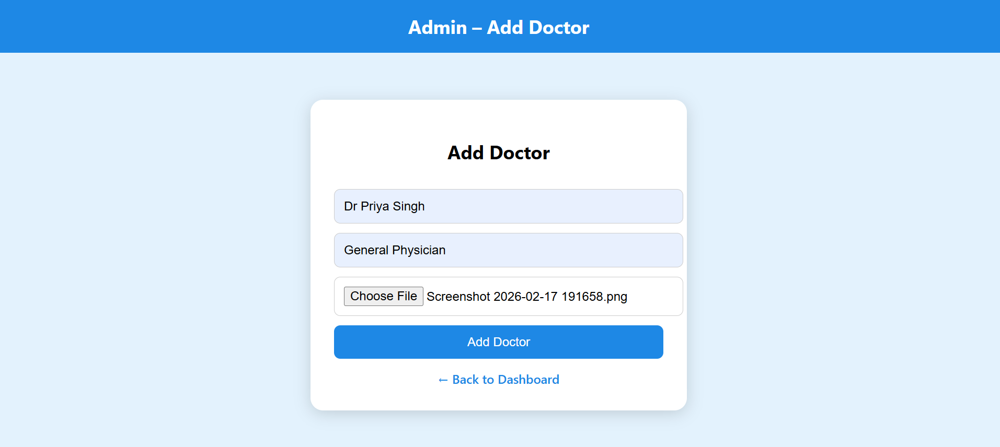

### Manage Appointments
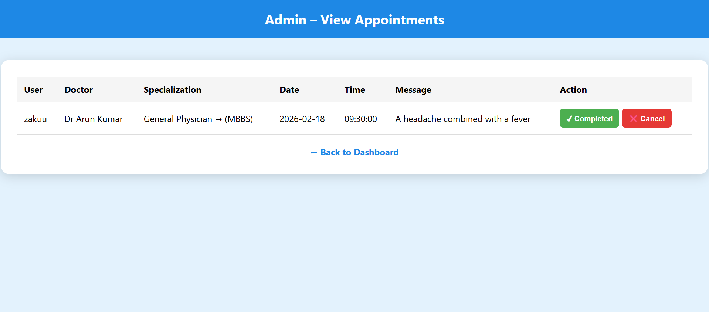

---

## Database Tables

### Users Table
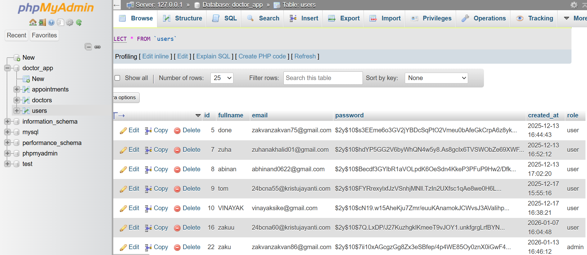

### Doctors Table
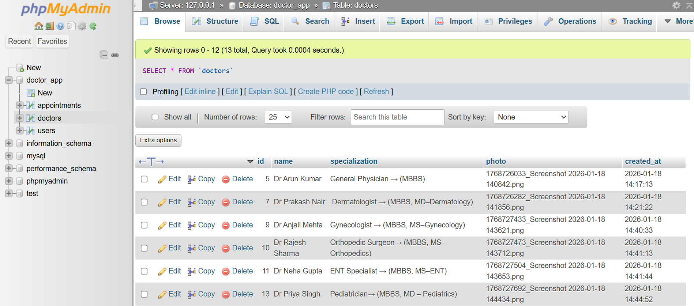

### Appointments Table
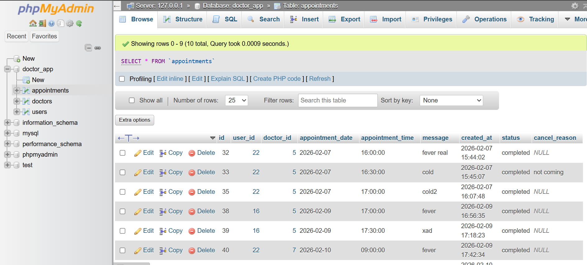

