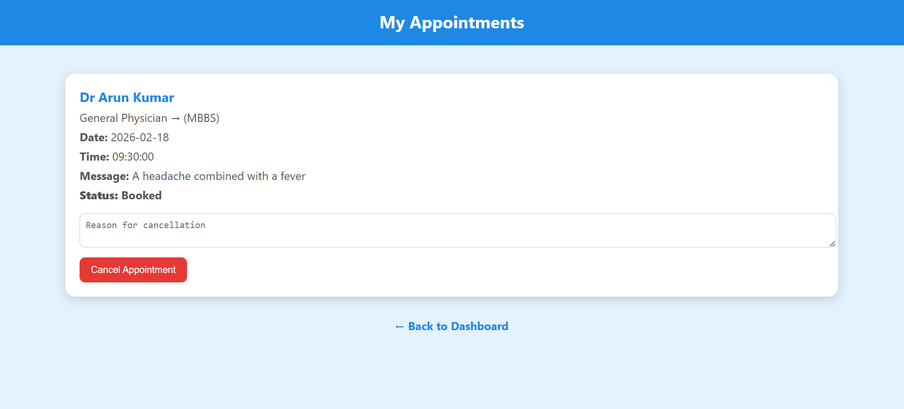
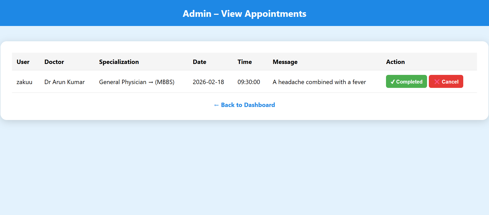
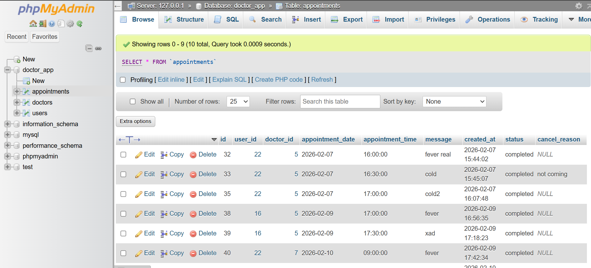
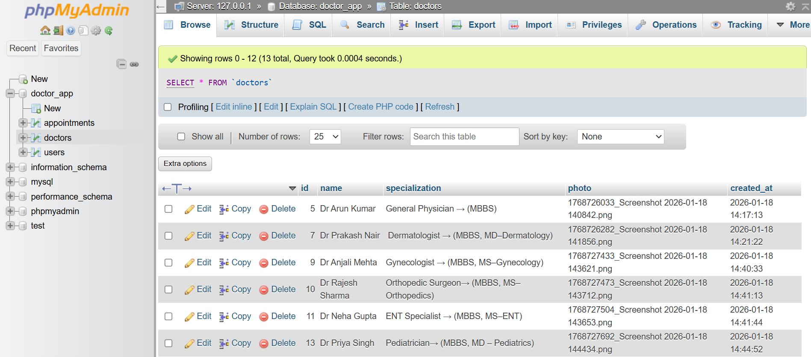
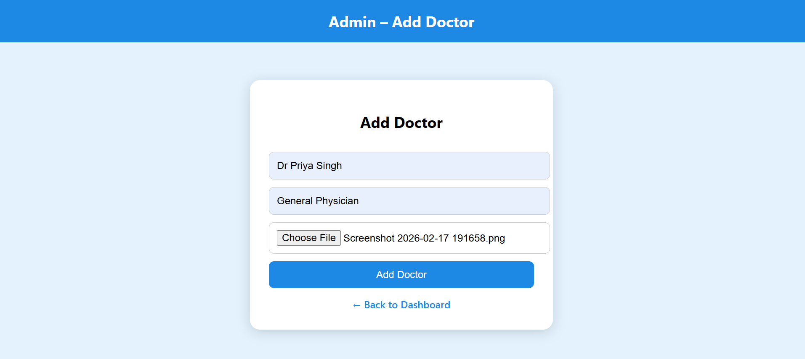
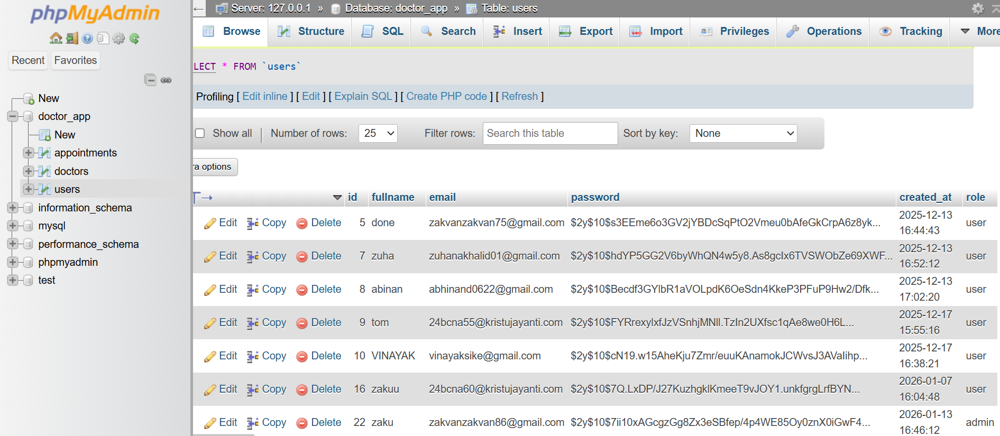

# 🏥 Doctor Appointment Booking System


A full-stack web-based Doctor Appointment Booking System built with PHP and MySQL. Users can register securely via email OTP, book and manage doctor appointments, while admins have full control over doctors and bookings through a dedicated admin panel.

---

## 📌 Project Overview

Developed a complete end-to-end appointment management system with secure authentication, real-time slot fetching, and role-based access for both patients and administrators. The system handles the full appointment lifecycle — from registration to booking to cancellation.

| Feature | Patient | Admin |
|:---|:---:|:---:|
| Register with Email OTP | ✅ | — |
| Login / Logout | ✅ | ✅ |
| Book Appointments | ✅ | — |
| View / Cancel Bookings | ✅ | ✅ |
| Manage Doctors | — | ✅ |
| Forgot Password Reset | ✅ | ✅ |

---

## 🖼️ Screenshots

### Login


### Register


### OTP Verification


### User Dashboard


### Book Appointment


### My Appointments


### View Doctors


### Admin Dashboard


### Manage All Appointments


### Appointments Table


### Doctors Table


### Add Doctor


### Users Table


---

## 🔑 Key Features

- 🔐 **Secure Registration** — Email OTP verification for new user sign-up
- 🔑 **Login / Logout** — Session-based authentication for patients and admins
- 📅 **Book Appointments** — Real-time doctor slot fetching and booking
- ❌ **Cancel Appointments** — Users can cancel upcoming bookings anytime
- 👨‍⚕️ **Admin Panel** — Admins can add/manage doctors and view all appointments
- 🔒 **Forgot Password** — Secure OTP-based password reset via email
- 📋 **My Appointments** — Patients can view full booking history
- 👥 **Users Table** — Admin can view and manage all registered users

---

## 🛠️ Tech Stack

| Technology | Purpose |
|---|---|
| PHP | Backend logic & server-side processing |
| MySQL | Database for users, doctors & appointments |
| HTML / CSS | Frontend structure & styling |
| PHPMailer / SMTP | Email OTP delivery |
| JavaScript | Dynamic slot fetching & form validation |

---

## 📁 Project Structure

```
doctor-appointment-system/
├── login.php                  # User login page
├── register.php               # New user registration with OTP
├── verify_otp.php             # OTP verification
├── dashboard.php              # Patient dashboard
├── doctors.php                # Browse available doctors
├── book.php                   # Book an appointment
├── save_appointment.php       # Save booking to database
├── fetch_slots.php            # Fetch available time slots
├── my_appointments.php        # View patient bookings
├── cancel_appointment.php     # Cancel a booking
├── forgot_password.php        # Forgot password page
├── send_otp.php               # Send OTP via email
├── send_reset_otp.php         # Send password reset OTP
├── reset_password.php         # Reset password page
├── clear_otp.php              # Clear expired OTPs
├── admin_bookings.php         # Admin — manage all bookings
├── admin_add_doctor.php       # Admin — add new doctors
├── db.php                     # Database connection
├── style.css                  # Global styles
└── assets/screenshots/        # All project screenshots
```

---

## 🚀 How to Use

1. **Clone the repository**
   ```bash
   git clone https://github.com/zakvanzakvan86-dev/doctor-appointment-system.git
   ```

2. **Import the database**
   - Open `phpMyAdmin`
   - Create a new database called `doctor_appointment`
   - Import the provided `.sql` file

3. **Configure database connection**
   - Open `db.php` and update your credentials:
   ```php
   $host = "localhost";
   $user = "root";
   $password = "";
   $database = "doctor_appointment";
   ```

4. **Configure email for OTP**
   - Update SMTP credentials in `send_otp.php` and `send_reset_otp.php`

5. **Run the project**
   - Place the folder in `htdocs` (XAMPP) or `www` (WAMP)
   - Start Apache & MySQL
   - Visit `http://localhost/doctor-appointment-system/login.php`

---

## 📢 Key Highlights

- Built complete **role-based access control** — separate flows for patients and admins
- Implemented **email OTP authentication** for both registration and password reset
- Used **real-time slot fetching** with JavaScript and PHP to prevent double bookings
- Designed a clean, responsive UI with pure CSS — no external frameworks needed
- Full **CRUD operations** on doctors, appointments, and user accounts

---

## 🙌 Acknowledgments

Built as part of a full-stack PHP development learning journey. Special thanks to the open-source PHP and MySQL community for documentation and support.
