# 🏥 Doctor Appointment Booking System


A full-stack web-based Doctor Appointment Booking System built with PHP and MySQL. Users can register securely via email OTP, book and manage doctor appointments, leave feedback, use an AI chat assistant, and browse doctor profiles — while admins have full control over doctors, bookings, and feedback through a dedicated admin panel.

---

## 📌 Project Overview

A complete end-to-end appointment management system with secure authentication, real-time slot fetching, AI chat support, doctor profile browsing, feedback system, and role-based access for both patients and administrators.

| Feature | Patient | Admin |
|:---|:---:|:---:|
| Register with Email OTP | ✅ | — |
| Login / Logout | ✅ | ✅ |
| Book Appointments | ✅ | — |
| View / Cancel Appointments | ✅ | ✅ |
| Doctor Profile View | ✅ | — |
| Find a Doctor | ✅ | — |
| Submit Feedback | ✅ | — |
| AI Chat Assistant | ✅ | — |
| Manage Doctors | — | ✅ |
| View All Feedback | — | ✅ |
| Manage All Appointments | — | ✅ |
| Forgot Password Reset | ✅ | ✅ |

---

## 🖼️ Screenshots

### Login
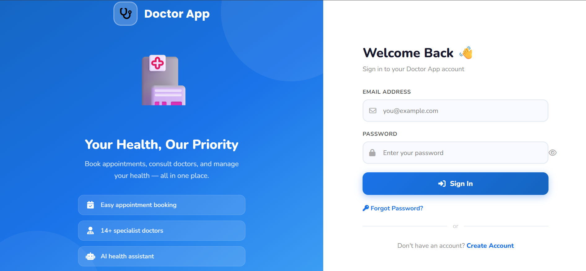

### Register
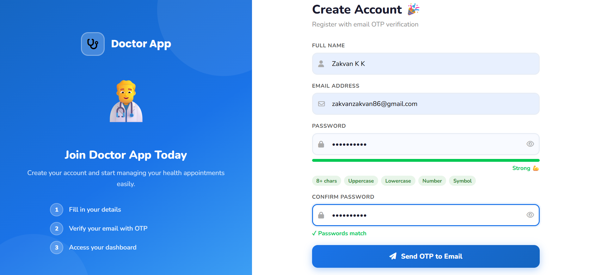

### OTP Verification
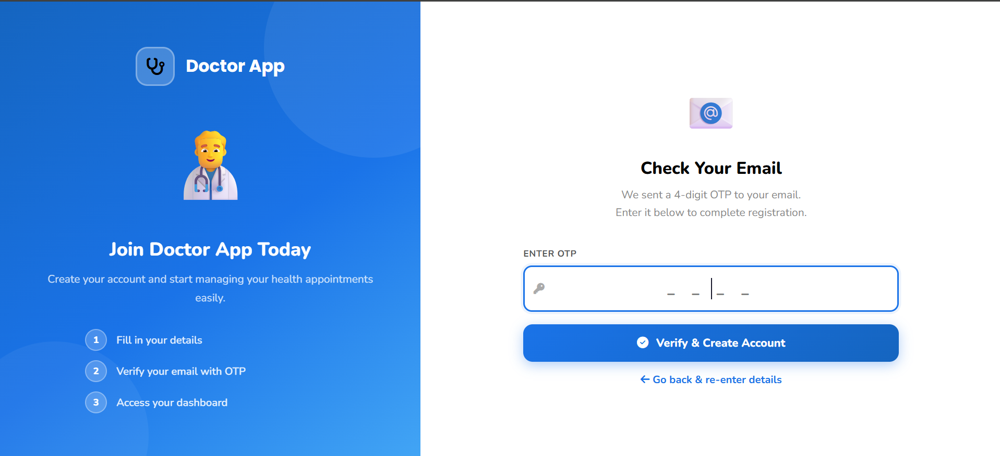

### User Dashboard
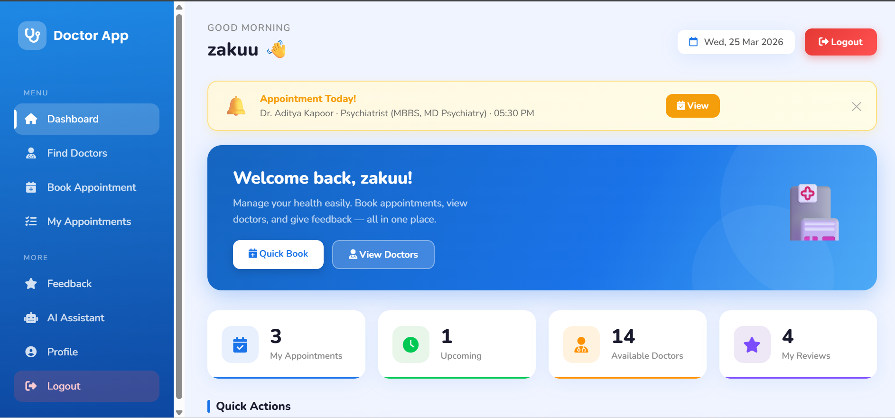

### Find a Doctor
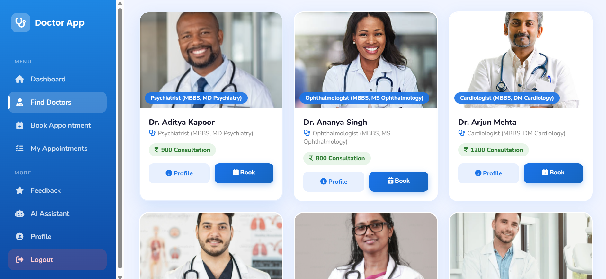

### Doctor Profile
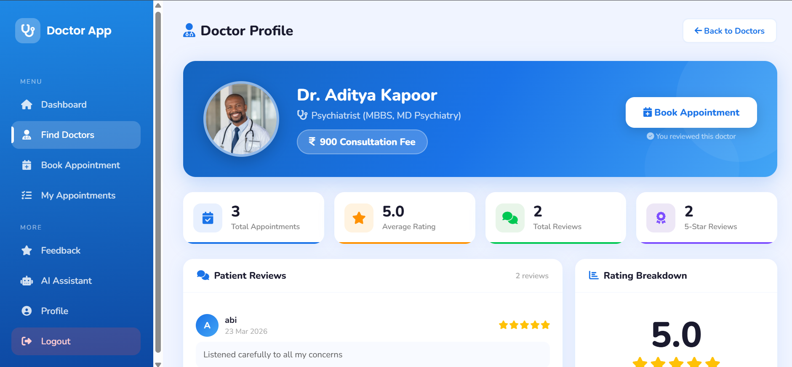

### Book Appointment
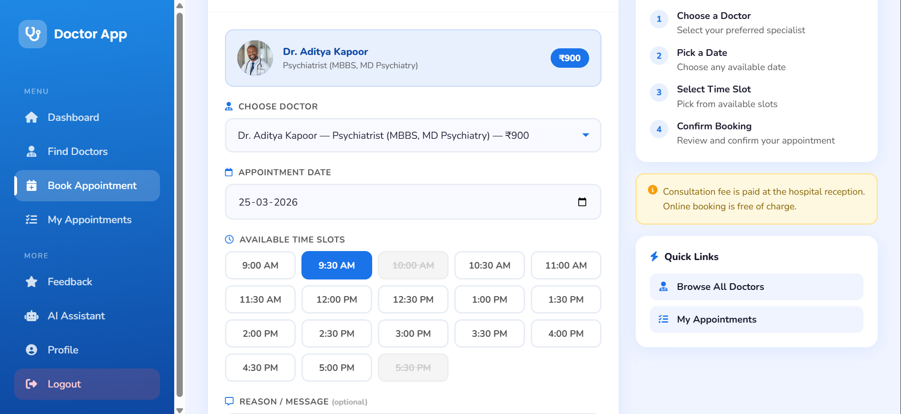

### My Appointments
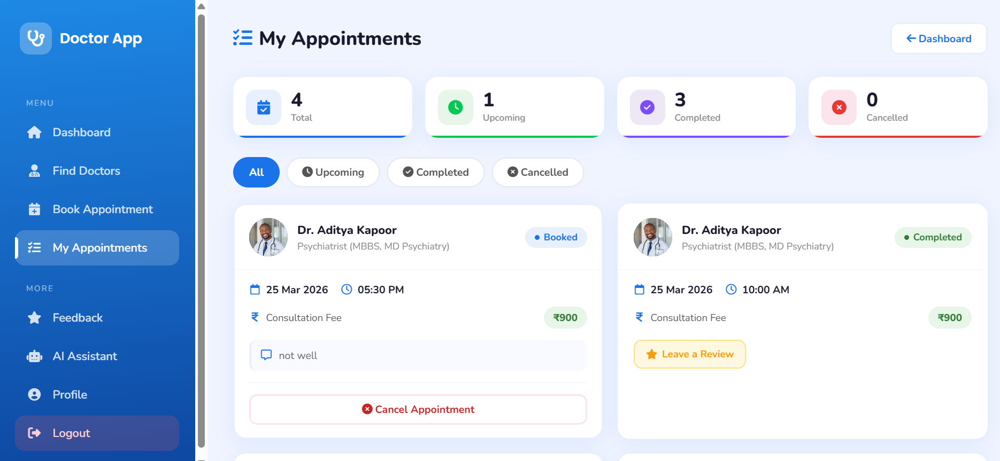

### Feedback
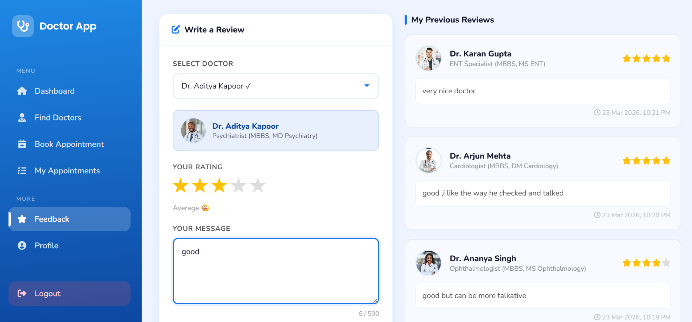

### AI Chat Assistant
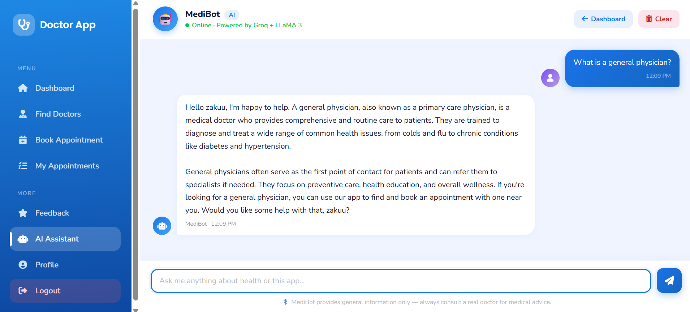

### Forgot Password
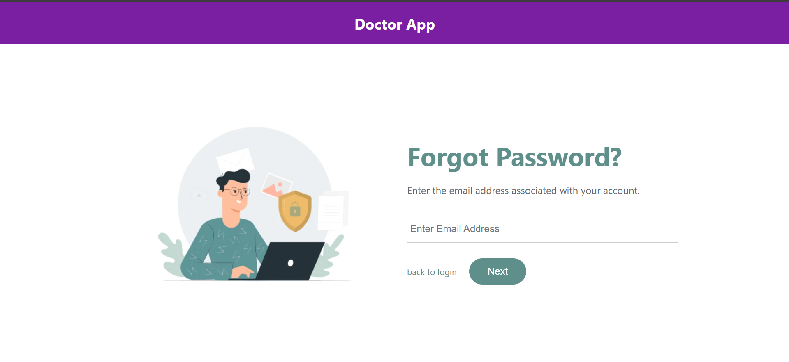

### Admin Dashboard
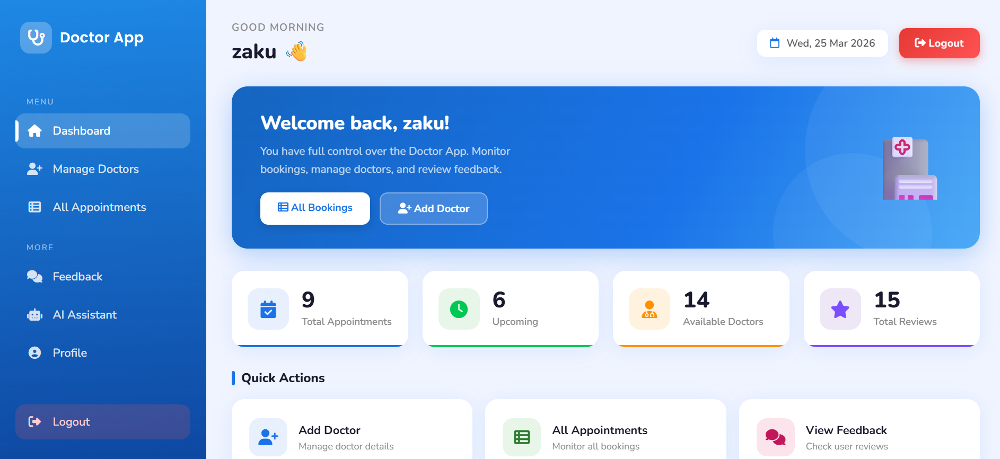

### Admin Dashboard (End)
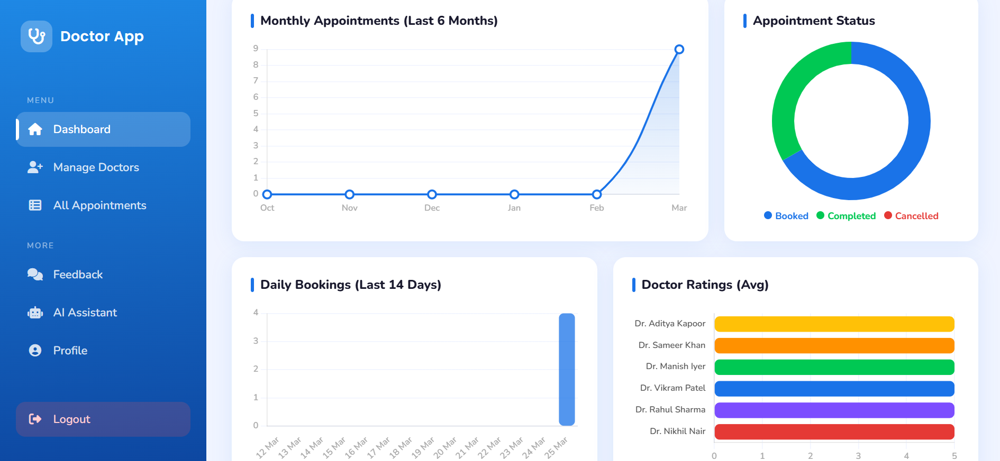

### Manage All Appointments
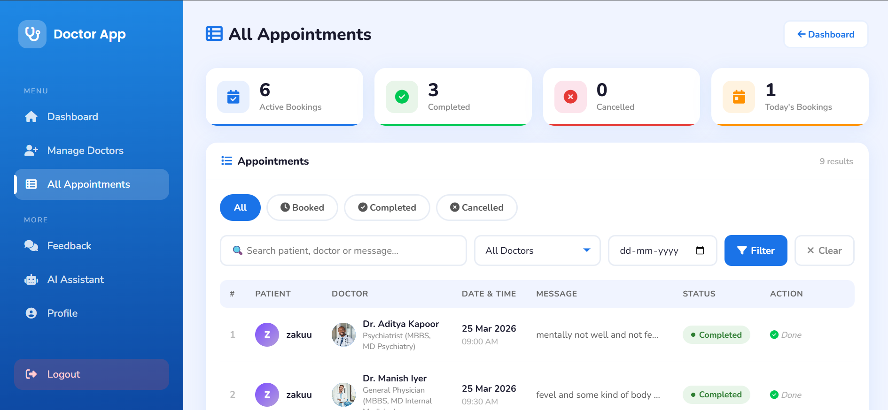

### Manage All Feedback
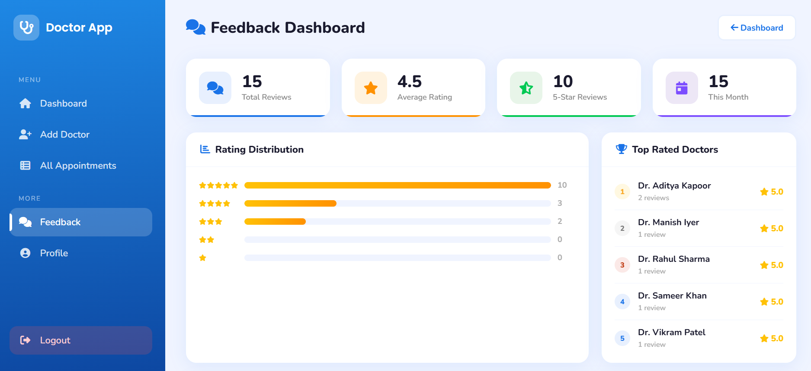

### All Feedback (End)
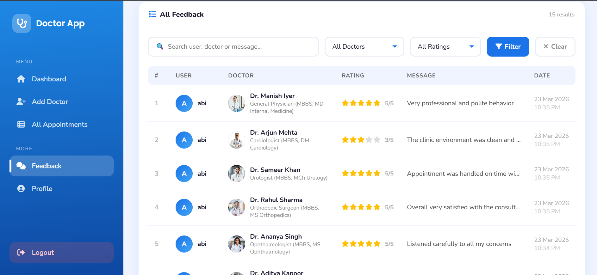

### Manage Doctors
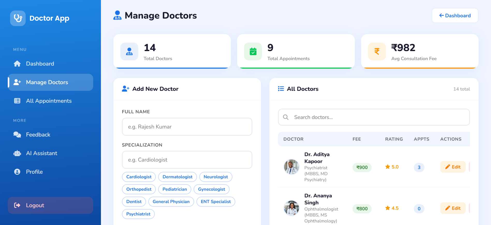

### Profile
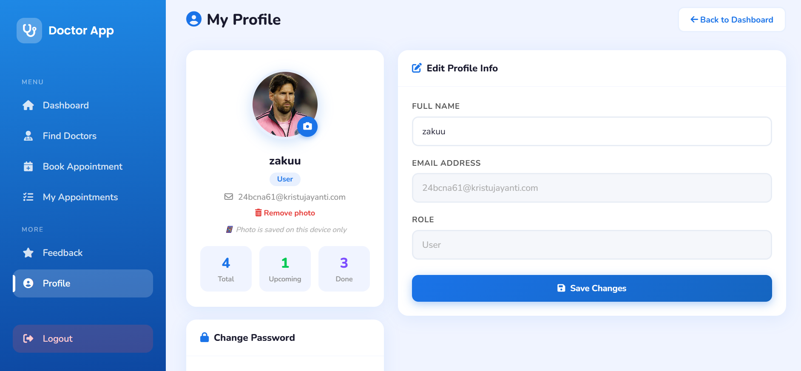

---

## 🔑 Key Features

- 🔐 **Secure Registration** — Email OTP verification for new user sign-up
- 🔑 **Login / Logout** — Session-based authentication for patients and admins
- 🩺 **Find a Doctor** — Search and browse available doctors by specialty or name
- 👨‍⚕️ **Doctor Profiles** — View detailed doctor profiles before booking
- 📅 **Book Appointments** — Real-time slot fetching to prevent double bookings
- ❌ **Cancel Appointments** — Users can cancel upcoming bookings anytime
- 💬 **AI Chat Assistant** — Built-in AI chat to answer patient queries
- ⭐ **Feedback System** — Patients can submit feedback; admins can review all feedback
- 🔒 **Forgot Password** — Secure OTP-based password reset via email
- 📋 **My Appointments** — Patients can view their full booking history
- 🛠️ **Admin Panel** — Full control over doctors, appointments, users, and feedback

---

## 🛠️ Tech Stack

| Technology | Purpose |
|---|---|
| PHP | Backend logic & server-side processing |
| MySQL | Database for users, doctors, appointments & feedback |
| HTML / CSS | Frontend structure & styling |
| PHPMailer / SMTP | Email OTP delivery |
| JavaScript | Dynamic slot fetching, AI chat & form validation |

---

## 📁 Project Structure

```
doctor-appointment-system/
├── login.php                  # User login page
├── register.php               # New user registration with OTP
├── verify_otp.php             # OTP verification
├── dashboard.php              # Patient dashboard
├── find_doctor.php            # Search and browse doctors
├── doctor_profile.php         # View individual doctor profile
├── book.php                   # Book an appointment
├── save_appointment.php       # Save booking to database
├── fetch_slots.php            # Fetch available time slots
├── my_appointments.php        # View patient bookings
├── cancel_appointment.php     # Cancel a booking
├── feedback.php               # Submit patient feedback
├── ai_chat.php                # AI chat assistant
├── profile.php                # User profile page
├── forgot_password.php        # Forgot password page
├── send_otp.php               # Send OTP via email
├── send_reset_otp.php         # Send password reset OTP
├── reset_password.php         # Reset password page
├── clear_otp.php              # Clear expired OTPs
├── admin_dashboard.php        # Admin dashboard overview
├── admin_bookings.php         # Admin — manage all bookings
├── admin_add_doctor.php       # Admin — add new doctors
├── admin_manage_doctor.php    # Admin — manage existing doctors
├── admin_feedback.php         # Admin — view all feedback
├── db.php                     # Database connection
├── style.css                  # Global styles
└── assets/screenshots/        # All project screenshots
    ├── login.png
    ├── register.png
    ├── otp.png
    ├── user_dashboard.png
    ├── find_doctor.png
    ├── doctor_profile.png
    ├── book_appointment.png
    ├── my_appointment.png
    ├── feedback.png
    ├── ai_chat.png
    ├── forgot_password.png
    ├── profile.png
    ├── admin_dashboard.png
    ├── admin_dashboard_end.png
    ├── all_appointment.png
    ├── all_feedback.png
    ├── all_feedback_end.png
    └── manage_doctor.png
```

---

## 🚀 How to Use

1. **Clone the repository**
   ```bash
   git clone https://github.com/zakvanzakvan86-dev/doctor-appointment-system.git
   ```

2. **Import the database**
   - Open `phpMyAdmin`
   - Create a new database called `doctor_appointment`
   - Import the provided `.sql` file

3. **Configure database connection**
   - Open `db.php` and update your credentials:
   ```php
   $host = "localhost";
   $user = "root";
   $password = "";
   $database = "doctor_appointment";
   ```

4. **Configure email for OTP**
   - Update SMTP credentials in `send_otp.php` and `send_reset_otp.php`

5. **Run the project**
   - Place the folder in `htdocs` (XAMPP) or `www` (WAMP)
   - Start Apache & MySQL
   - Visit `http://localhost/doctor-appointment-system/login.php`

---

## 📢 Key Highlights

- Built complete **role-based access control** — separate flows for patients and admins
- Implemented **email OTP authentication** for both registration and password reset
- Integrated **AI Chat Assistant** to help patients with common queries
- Added **Doctor Profile** and **Find Doctor** pages for easy doctor discovery
- Built a **Feedback System** for patients to rate and review their experience
- Used **real-time slot fetching** with JavaScript and PHP to prevent double bookings
- Designed a clean, responsive UI with pure CSS — no external frameworks needed
- Full **CRUD operations** on doctors, appointments, users, and feedback

---

## 🙌 Acknowledgments

Built as part of a full-stack PHP development learning journey. Special thanks to the open-source PHP and MySQL community for documentation and support.documentation and support.
